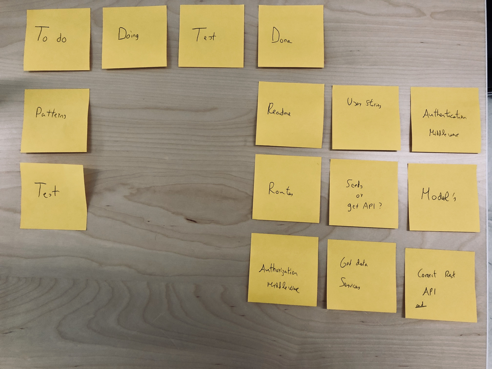

# Project Name

Insurance company app

## Description

This is an app to test my node.js knowledge. We are gonna take information off an WEB API, render the information in the backend with handlebar, create a REST API server, and implement authentication and authorization.

## User Stories

- **404** - As a user I want to see a nice 404 page when I go to a page that doesn’t exist so that I know it was my fault
- **500** - As a user I want to see a nice error page when it's an internal error so that I know that is not my fault
- **Get user data filtered by user id** - As a user or admin I can get user's data filtered by user id
- **Get user data filtered by username** - As a user or admin I can access to user's data filtered by user name
- **Get all insurance policies list** - As an user I want to see all the policies linked to a username
- **Get policies details** - As an admin I want to see the insurance policy details

## API Endpints:

Api entry point: https://localhost:3000/api

| HTTP Method |       URL       | Request Body | Success status | Error Status |                                                                                                        Description |
| ----------- | :-------------: | :----------: | :------------: | :----------: | -----------------------------------------------------------------------------------------------------------------: |
| POST        |   /api/login    |   {email}    |      200       |     400      |                                check if the email is in the data received from external API. If it is, save token. |
| POST        |   /api/logout   |              |      200       |     400      |                                                                                      Clear cookie. Logout of user. |
| GET         |  /api/users/id  |     {id}     |      200       |     404      |                           Check if there is an existing token and get the user's data by the id passed in the body |
| GET         | /api/users/name |    {name}    |      200       |     404      |                               Check if there is an existing token and get user data by username passed in the body |
| GET         |  /users/policy  |  {policyId}  |      200       |     404      |      Check if there is an existing token and if the logged in user is an admin. Get the user data linked to policy |
| GET         | /policies/:name |    {name}    |      200       |     404      | Check if there is an existing token and if the logged in user is an admin. Get all the policies linked to username |

## Devstacks

Node.Js , Express.

## Installation & demo instruction

After forking or cloning the repository

cd nameofthefolder

nodemon start-dev

## Kanban

I've used the kanban methodology to have in mind, what I should focus my attention to, and which is the next step.

Here's a foto of my Kanban on this project.

